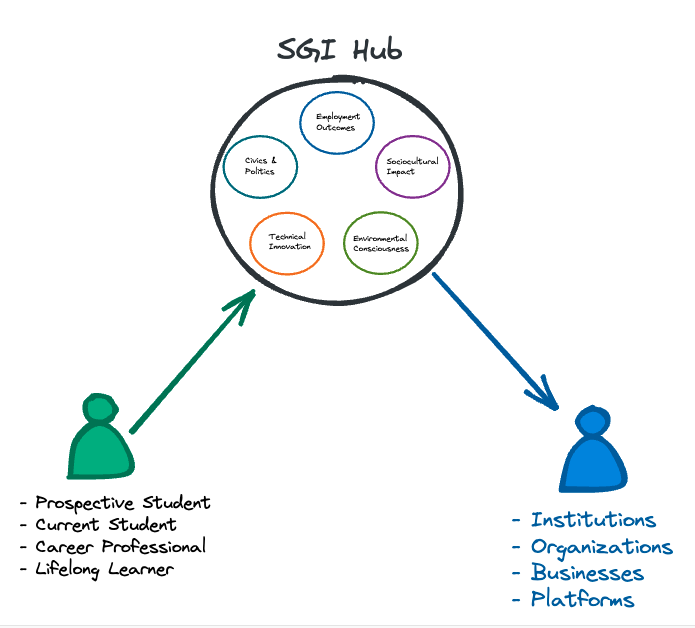
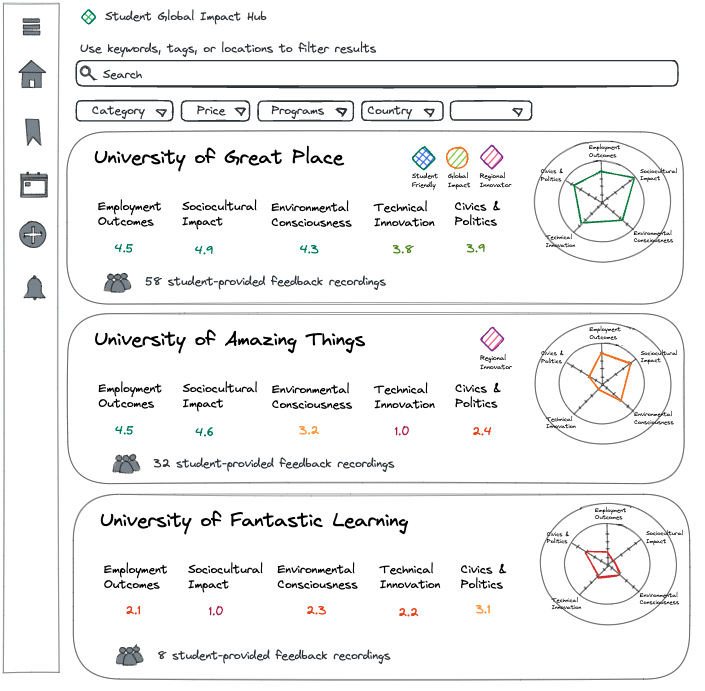
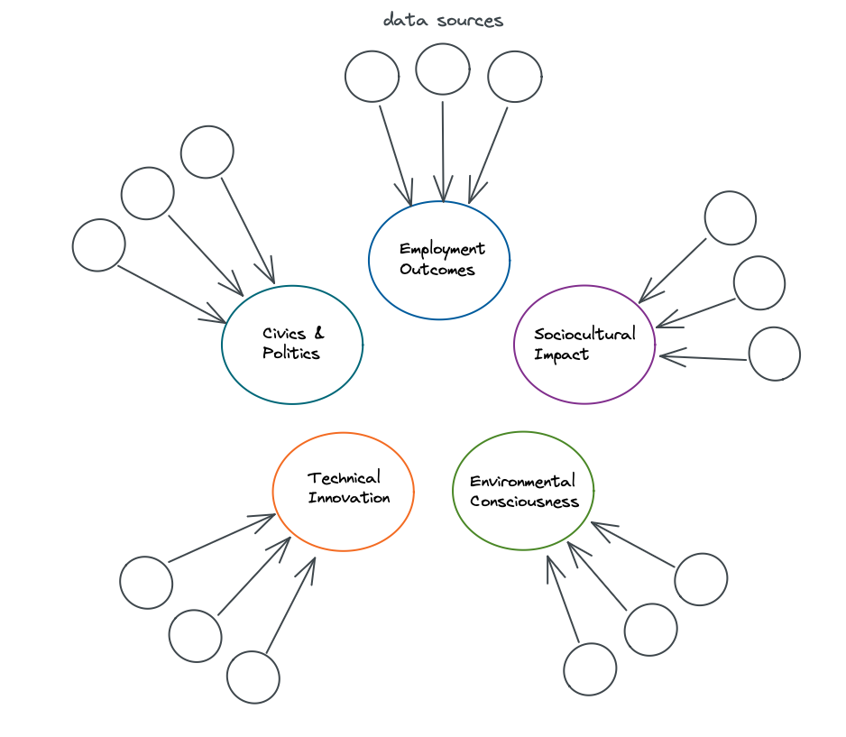

# Student Global Impact Hub - Technical Roadmap

This document is intended to outline a technical roadmap for the Student Global Impact (SGI) Hub. 

## Background

The structure of this section is loosely based around [objective key results (OKR's)](https://en.wikipedia.org/wiki/OKR).

- __Objectives__: 
    - Create a [minimum viable product (MVP)](https://en.wikipedia.org/wiki/Minimum_viable_product) of the Student Global Impact (SGI) Hub.
    - SGI Hub MVP implements framework as designed by team collaborators.
    - SGI Hub MVP is tested by cohort of real-world students and institutions.
    - SGI Hub MVP has extended roadmap for scaled deployment (phase 3 of original timeline).
    - SGI Hub MVP includes reproducibility as a theme by default, including [infrastructure as code](https://en.wikipedia.org/wiki/Infrastructure_as_code) where possible, transparent data sourcing and analysis, etc.
    - SGI Hub MVP includes data features which could be used by external institutions, organizations, or companies.
- __Deadline__: roughly one year from February 2022 (February 2023)

## Components

The technical roadmap includes the following key components.

- [__Front-end__](#front-end): How the product is used by the audience (website, apps, etc).
- [__Data Storage__](#data-storage): Where data is stored (for ex. databases, etc).
- [__Workflow Orchestration__](#workflow-orchestration): How data is moved.
- [__Data Integration__](#data-integration): How data is extracted or loaded.
- [__Data Model__](#data-model): How data is modeled and aligned with framework.

### Front-end

This section describes the technology behind how the SGI Hub will be used by the audience.

- __Web-app__: A web-app will be used to make the product available to the audience.
    - Web-app is accessible from desktop or mobile devices (responsive design).
    - Resources:
        - [Github pages](https://pages.github.com/)

### Data Storage

This section describes how data will be stored for use within SGI Hub.

- __Database__: A database will be necessary for storing prepared datasets used by front-end components.
    - Database must be accessible by front-end.
    - Database must be flexible to needs of modeling and framework.
    - Database may benefit from GraphQL functionality both for modeling and front-end access.
    - Resources:
        - [Hasura](https://hasura.io/)
        - [Azure Cosmos DB](https://docs.microsoft.com/en-us/azure/cosmos-db/introduction)
        - [Azure Managed Databases](https://azure.microsoft.com/en-us/solutions/databases/#products)
- __External Data Sources__: external data sources will be required to accomplish this work.
    - Secure API queries are preferred where possible in order to flexibly stay up to date.
    - One-time data extracts may be required for MVP but are inappropriate for scaled implementations.
    - Resources:
        - [Data.gov](https://data.gov)

### Workflow Orchestration

This section describes how data will orchestrated with workflows (moved) for use within SGI Hub.

- __Orchestrator__: An orchestrator will be required for implementing data workflows (moving data).
    - Orchestrator must be scalable to needs of many procedures.
    - Orchestrator must be observable by nature (include logs, status, etc).
    - Orchestrator must be reproducible by nature (include code, backups, etc).
    - Resources:
        - [Azure Synapse Analytics - Notebooks and/or Pipelines](https://azure.microsoft.com/en-us/services/synapse-analytics/)

### Data Integration

This section describes how data will be extracted, transformed or loaded for use within SGI Hub.

- __Extract, Transform, Load (ETL) Tools__: ETL tools are needed for interfacing with datasets.
    - ETL tools must include repeatable patterns (connectors) used by one-to-many integrations.
    - Resources:
        - [Azure Synapse Analytics - Notebooks and/or Pipelines](https://azure.microsoft.com/en-us/services/synapse-analytics/)

### Data Model

This section describes how data will be modeled for use within SGI Hub.

- __Graph Network__: Data will be modeled around a graph of related nodes which produce Triple+ Bottom Line visibility for students.
    - Graph nodes may be used as composites of many other data sources in order to provide unique SGI Hub scores, backed by framework and research.
    - Model is implemented using documented relationships.
    - Modeling requires data catalog and data dictionary.